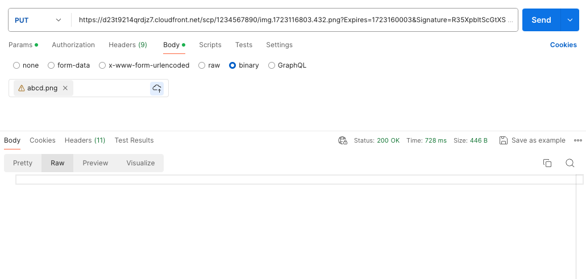
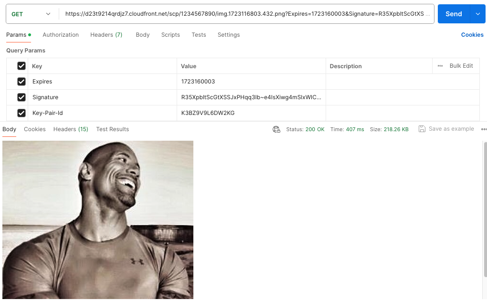

# my_aidecipher_sever

## 프로젝트 구조
    root
    ├── src
    │   ├── app
    │   │   ├── api
    │   │   │   ├── 이름
    │   │   │   │   ├── 이름_router.py
    │   │   │   │   ├── 이름_spec.py
    │   │   │   │   └── 이름_api.py
    │   │   │   └── ...
    │   │   ├── data
    │   │   │   ├── 이름
    │   │   │   │   ├── 이름_schema.py
    │   │   │   │   └── 이름_data.py
    │   │   │   └── ...  
    │   │   ├── core
    │   │   ├── config
    │   │   ├── client
    │   │   ├── aws
    │   │   ├── middleware
    │   │   ├── util
    │   │   ├── type
    │   │   ├── worker
    │   │   │   ├── 이름
    │   │   │   │   └── 이름_worker.py
    │   │   │   └── ...  
    │   │   ├── __init__.py
    │   │   ├── main_api.py
    │   │   └── main_worker.py
    │   ├── resource
    │   │   └── ...
    │   ├── test
    │   │   └── ...
    │   ├── ...
    │   └── requirements.txt
    ├── docker
    │   ├── Dockerfile
    │   └── ...
    ├── secret
    │   ├── aws_config
    │   ├── aws_credentials
    │   └── ...
    ├── .env
    ├── .dockerignore
    ├── docker-compose.yaml
    ├── Makefile
    ├── sam-api-dev.yaml
    ├── sam-worker-dev.yaml
    ├── samconfig.toml
    ├── .gitignore
    └── README.md
---
## Docker 이미지 빌드 
```
make build
make build-local

docker tag scp-aislider-app:1.0.0 leebs1986/my_aidecipher_server:1.0.0
docker push leebs1986/my_aidecipher_server:1.0.0
```
## 테스트


